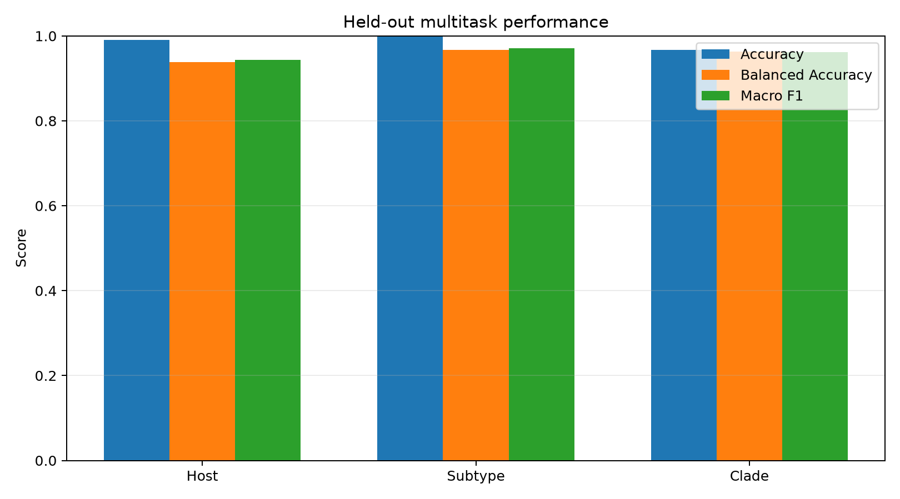
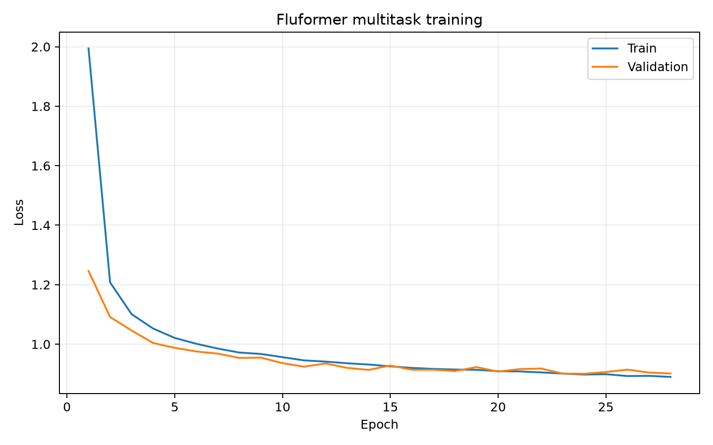
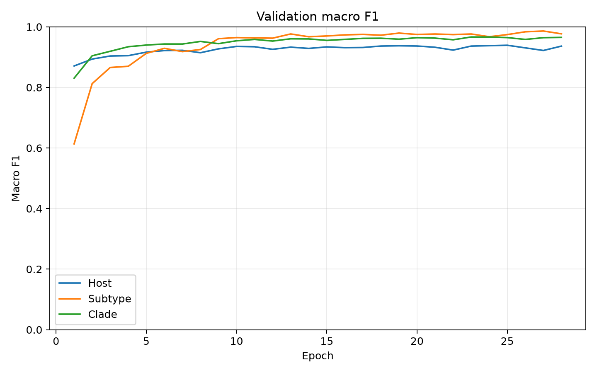
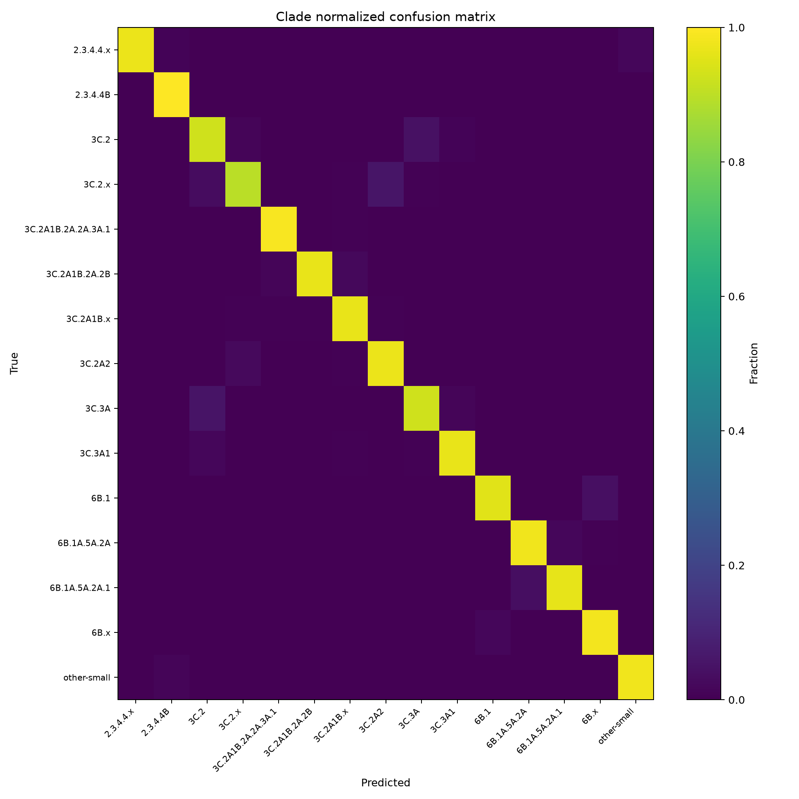

# Fluformer

[](https://github.com/williamtbarker/fluformer/actions/workflows/ci.yml)
[](https://github.com/williamtbarker/fluformer/blob/main/LICENSE)
[](https://github.com/williamtbarker/fluformer/releases)

**Multitask learning and temporally conditioned protein modeling for influenza proteome representations.**

Fluformer is a PyTorch research package for experiments combining protein-language-model embeddings, multitask classification, temporal conditioning, and conditional sequence modeling for viral protein systems. This model in particular is designed around the known influenza proteome of 10 major protein products derived from eight gene segments. 

The current release provides two complementary model families:

- **`MultiTaskMLP`** — a shared representation with configurable classification heads for related prediction tasks.
- **`ConditionalProteinVAE`** — a conditional variational autoencoder combining protein-language-model representations, temporal context, latent-variable modeling, and causal Transformer decoding.

The package is intentionally dataset-independent at the model layer: preprocessing, accession handling, embedding generation, metadata schemas, and dataset-specific scientific decisions remain outside the core model API.

---

## Why Fluformer?

Influenza viruses provide a natural setting for representation-learning experiments because each isolate can be described simultaneously at several biological levels.

A protein-language model can first convert viral proteins into continuous representations. Fluformer then asks whether those representations can support related downstream tasks through a shared learned representation and whether temporal context can be incorporated into conditional latent-variable models.

The software is designed around several principles:

- reusable model components rather than dataset-specific training code;
- explicit tensor contracts and configuration validation;
- multiple related prediction heads sharing a common representation;
- accelerator-independent execution across CPU, CUDA, and Apple MPS;
- causal correctness for autoregressive decoding;
- reproducible evaluation;
- clear separation between software validation and scientific validation.

---

## Architecture

### Multitask protein-embedding classifier

`MultiTaskMLP` accepts a fixed-length representation and passes it through a shared nonlinear trunk followed by one classification head per task.

```text
Protein embeddings
       │
       ▼
┌─────────────────┐
│  Shared MLP     │
│ representation  │
└────────┬────────┘
         │
    ┌────┼─────┐
    ▼    ▼     ▼
  Host Subtype Clade
  head   head   head
```

Task names and class counts are configurable.

```python
from fluformer import MultiTaskConfig, MultiTaskMLP

config = MultiTaskConfig(
    input_dim=6400,
    task_sizes={
        "host": 4,
        "subtype": 8,
        "clade": 15,
    },
    hidden_dims=(1024, 512, 256),
    dropout=0.2,
)

model = MultiTaskMLP(config)
```

### Conditional protein VAE

`ConditionalProteinVAE` provides a second experimental architecture for conditional sequence modeling.

The encoder combines:

1. token-level protein-language-model embeddings;
2. a global protein embedding; and
3. a learned discrete temporal embedding.

These representations parameterize a Gaussian latent distribution.

The decoder combines latent and temporal conditioning through a separate Transformer memory representation and generates tokens autoregressively under a causal mask.

```text
Token embeddings ─┐
                  │
Global embedding ─┼──► Conditional encoder ──► μ, log σ² ──► z
                  │                                  │
Time index ───────┘                                  │
                                                     ▼
Time index ───────────────────────────────► Causal Transformer
                                                     │
                                                     ▼
                                               Token logits
```

Future target tokens are not exposed through decoder memory.

```python
from fluformer import CVAEConfig, ConditionalProteinVAE

config = CVAEConfig(
    esm_dim=640,
    vocab_size=32,
    num_time_tokens=64,
)

model = ConditionalProteinVAE(config)
```

---

# Real-data benchmark

A reference benchmark was run against precomputed influenza proteome representations containing **150,000 isolate records with no isolate-ID overlap across train, validation, and test splits**:

| Split | Isolates |
|---|---:|
| Training | 120,000 |
| Validation | 15,000 |
| Held-out test | 15,000 |

Each isolate was represented by a **6,400-dimensional feature vector** constructed by concatenating ten 640-dimensional protein-language-model mean embeddings.

The ten represented influenza proteins were:

`HA`, `NA`, `PB1`, `PB2`, `PA`, `NP`, `NEP`, `NS1`, `M1`, and `M2`.

The benchmark contained three simultaneous classification tasks:

| Task | Classes |
|---|---:|
| Host | 4 |
| Subtype | 8 |
| Clade | 15 |

The evaluated `MultiTaskMLP` contained **7,217,691 trainable parameters**.

Model selection used validation macro-F1. The held-out test set was evaluated only after the best validation checkpoint had been selected.

## Held-out performance

| Task | Accuracy | Balanced accuracy | Macro-F1 | Weighted F1 |
|---|---:|---:|---:|---:|
| **Host** | **0.9908** | **0.9385** | **0.9438** | **0.9907** |
| **Subtype** | **0.9979** | **0.9676** | **0.9716** | **0.9978** |
| **Clade** | **0.9668** | **0.9625** | **0.9624** | **0.9668** |

The balanced-accuracy and macro-F1 results are particularly useful because the class distributions are not assumed to be uniform. High overall accuracy therefore does not by itself drive the performance summary.



## Training behavior

Training and validation loss decreased together during optimization and remained closely coupled through the later epochs.



Validation macro-F1 increased rapidly during early training and subsequently plateaued at high values for all three tasks.



The best checkpoint occurred at **epoch 23**, with mean validation macro-F1 of approximately **0.960**. Training was stopped after five subsequent epochs failed to exceed the best validation score.

The absence of a progressively widening train/validation loss gap provides no obvious evidence of conventional optimization overfitting in this run. This observation should not be interpreted as ruling out dataset-level similarity or other forms of information leakage; see [Interpretation and limitations](#interpretation-and-limitations).

## Error structure

The normalized clade confusion matrix shows a strongly diagonal prediction structure across the 15 evaluated clade labels, with the remaining errors concentrated among a relatively small number of class relationships.



Additional normalized confusion matrices are included for inspection:

- [`Host confusion matrix`](docs/assets/confusion_host.png)
- [`Subtype confusion matrix`](docs/assets/confusion_subtype.png)
- [`Clade confusion matrix`](docs/assets/confusion_clade.png)

Machine-readable benchmark summaries are available in:

- [`results/multitask_full_metrics.json`](results/multitask_full_metrics.json)
- [`results/multitask_full_history.csv`](results/multitask_full_history.csv)

---

## Interpretation and limitations

The benchmark demonstrates that fixed protein-language-model representations contain strong signal for the three evaluated retrospective classification tasks and that a shared multitask representation can recover that signal across host, subtype, and clade labels.

It does **not** establish prospective influenza forecasting performance.

The benchmark used held-out isolate-level train, validation, and test partitions. An explicit pre-training audit found:

- zero isolate-ID overlap between training and validation;
- zero isolate-ID overlap between training and test;
- zero isolate-ID overlap between validation and test; and
- zero duplicate isolate IDs within any split.

However, influenza datasets can contain closely related isolates and identical or near-identical protein sequences. Isolate-level separation therefore does not by itself establish sequence-family independence between partitions.

The current benchmark should consequently be interpreted as:

> **held-out retrospective classification of influenza proteome representations**

rather than:

> **prospective prediction of future influenza evolution**

A stronger prospective evaluation would use chronology-aware partitions and, where appropriate, sequence-similarity-aware grouping to measure generalization across both time and evolutionary distance.

---

## Benchmark reproducibility

The benchmark runner is included at:

```text
benchmarks/multitask_real_data.py
```

It accepts precomputed train, validation, and test tensors rather than embedding dataset-specific paths into the package.

Expected split structure:

```python
{
    "X": Tensor[N, 6400],
    "Y_host": Tensor[N],
    "Y_subtype": Tensor[N],
    "Y_clade": Tensor[N],
    "isolate_ids": list[str],
    "host_classes": list[str],
    "subtype_classes": list[str],
    "clade_classes": list[str],
}
```

Example:

```bash
python benchmarks/multitask_real_data.py \
  --train /path/to/train_data.pt \
  --val /path/to/val_data.pt \
  --test /path/to/test_data.pt \
  --out-dir outputs/multitask_full \
  --epochs 30 \
  --patience 5 \
  --batch-size 256
```

The benchmark runner performs a split-integrity audit before training and refuses to continue when isolate IDs overlap between train, validation, and test partitions.

Outputs include:

```text
data_audit.json
metrics.json
history.csv
predictions.csv
best_model.pt

training_loss.png
validation_macro_f1.png
test_metrics.png

confusion_host.png
confusion_subtype.png
confusion_clade.png

classification_report_host.csv
classification_report_subtype.csv
classification_report_clade.csv
```

Local benchmark outputs are ignored by Git by default.

---

## Installation

Fluformer requires Python 3.10 or newer.

```bash
git clone https://github.com/williamtbarker/fluformer.git
cd fluformer
python -m pip install -e .
```

For development:

```bash
python -m pip install -e '.[dev]'
```

For benchmark dependencies:

```bash
python -m pip install -e '.[benchmark]'
```

---

## Quick start

### Inspect the environment

```bash
fluformer doctor
```

Example Apple Silicon output:

```json
{
  "fluformer": "0.1.1",
  "torch": "2.14.0",
  "default_device": "mps",
  "cuda_available": false,
  "mps_available": true
}
```

### Run the synthetic smoke test

```bash
python examples/synthetic_demo.py
```

The synthetic example requires no influenza dataset and exercises both public model families.

---

## Public API

```python
from fluformer import (
    CVAEConfig,
    ConditionalProteinVAE,
    MultiTaskConfig,
    MultiTaskMLP,
)
```

Additional utilities are available from:

```python
from fluformer.models.multitask import multitask_loss, task_accuracy
from fluformer.training import multitask_train_step, resolve_device
```

---

## Data contracts

Fluformer deliberately does not impose a CSV, database, or accession schema.

### Multitask model

Input features:

```text
[batch, embedding_dim]
```

Targets are supplied as named integer class tensors.

### CVAE encoder

Token-level embeddings:

```text
[batch, tokens, esm_dim]
```

Global embeddings:

```text
[batch, esm_dim]
```

Time indices:

```text
[batch]
```

Optional token masks:

```text
[batch, tokens]
```

### CVAE decoder

Decoder inputs are integer token IDs using a caller-defined vocabulary.

Keeping sequence acquisition, accession handling, embedding storage, preprocessing, and metadata conventions outside the core package allows the model code to remain reusable.

---

## Software validation

The current test suite contains **79 tests** covering:

- configuration validation and boundary conditions;
- tensor-shape validation;
- masked and unmasked pooling;
- multitask output dimensions;
- task weighting and label smoothing;
- loss and accuracy calculations;
- gradient propagation;
- optimizer steps;
- optional gradient clipping;
- CPU, CUDA, and MPS device resolution;
- CVAE forward and backward passes;
- reconstruction and KL losses;
- padding-token handling;
- causal decoding;
- autoregressive sampling;
- temperature and top-k validation;
- deterministic seeded sampling;
- model state-dict round trips;
- CLI behavior;
- module entry points; and
- public API exports.

Run the complete suite:

```bash
python -m pytest \
  --cov=fluformer \
  --cov-branch \
  --cov-report=term-missing
```

Current software-validation baseline:

```text
79 passed
100% statement coverage
100% branch coverage
```

Static analysis:

```bash
ruff check .
```

Compilation check:

```bash
python -m compileall -q src
```

Package build:

```bash
python -m build
```

---

## Repository layout

```text
fluformer/
├── .github/workflows/       continuous integration
├── benchmarks/              reproducible benchmark runner
├── docs/assets/             README figures
├── examples/                data-free usage examples
├── results/                 compact reference benchmark summaries
├── src/fluformer/           library package
└── tests/                   regression and behavioral tests
```

Large datasets, protein embeddings, generated checkpoints, predictions, and local benchmark output directories are intentionally excluded from version control.

---

## Reproducing the embeddings

The reference benchmark used precomputed 640-dimensional protein-language-model mean representations derived from influenza protein sequences.

Dataset acquisition and source-specific preprocessing are intentionally outside the scope of this repository. Users are responsible for obtaining appropriate sequence data through authorized sources and complying with applicable data-access and usage terms.

The benchmark runner accepts precomputed representations through the documented data contract, allowing equivalent experiments to be performed with independently prepared datasets.

---

## Project status

Fluformer v0.1.1 establishes a tested public API for multitask protein-representation learning and conditional sequence-modeling experiments.

Near-term development priorities include:

- chronology-aware validation using temporal holdouts;
- sequence-similarity-aware split evaluation;
- reproducible embedding preprocessing;
- additional temporal model evaluation; and
- expanded validation of the conditional generative architecture.

Contributions that preserve explicit interfaces, reproducibility, causal correctness, and clear separation between software performance and scientific claims are welcome.

---

## Intended use

Fluformer is research software.

It is intended for architecture development, representation-learning experiments, multitask classification, temporal-conditioning research, conditional latent-variable modeling, and retrospective analysis of appropriately prepared protein representations.

It is **not** a clinical diagnostic device, surveillance service, epidemiological forecasting system, or validated predictor of future circulating influenza strains.

Model outputs require independent scientific validation before biological or operational interpretation.

---

## Citation

If Fluformer contributes to published work, please cite the repository.

---

## License

Fluformer is released under the MIT License. See [`LICENSE`](LICENSE).
